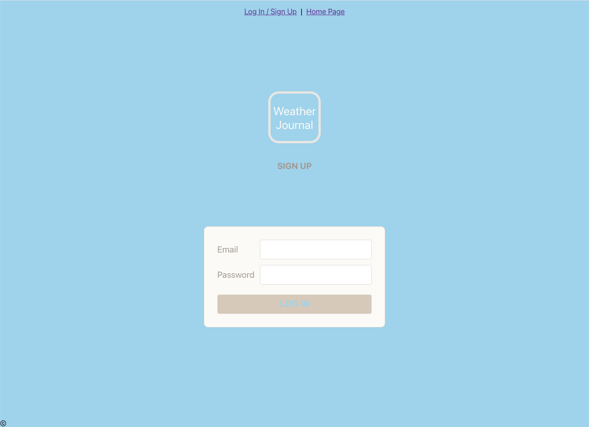
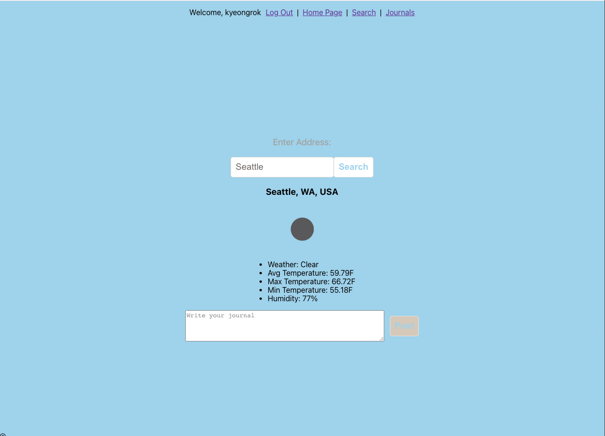
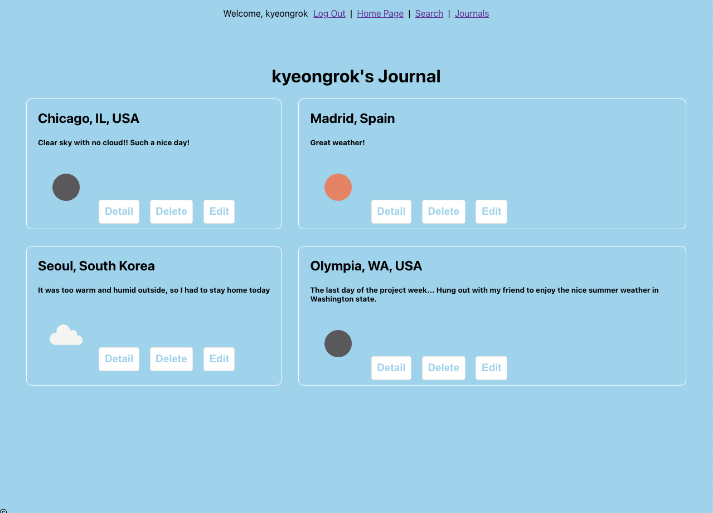

  

  

# My Weather Journal

### [My Weather Journal](https://my-tennis-tournament.herokuapp.com/)

##### Kyeongrok Kim

## :pencil: Description

My Weather Journal is a web application where you can post journals and save it with the weather in the city you're staying. Also you'll be able to search for the weather of the cities all over the world.

  

## :camera_flash: Screenshots

|              Description              | Screenshot                                       |
| :-----------------------------------: | ------------------------------------------------ |
|      <h3>Signup/Login Page</h3>       |     |
|  <h3 align="center">Search Page</h3>  |    |
| <h3 align="center">Journals Page</h3> |  |

## :computer: Technologies Used

## :fire: Getting Started

  
 How to start 

    1. Sign up and log in to the app 
    2. Go to the search page and search the address 
    3. Select the city 
    4. Post the journal 
    5. Look up the journals that you made

  
 How to Register for tournament 

    1. Log in with a Google account. 
    2. Register your information to the web app. 
    3. Click tournaments and choose the tournament you want to register. 
    4. In tournament details page, click register here button.

  
 Trello Board 

  <a href="https://trello.com/b/meCtfzNV/project4"
    > https://trello.com/b/meCtfzNV/project4 </a
  >

  
 Deployed Link (Heroku) 

  <a href="https://my-tennis-tournament.herokuapp.com/"
    > https://my-tennis-tournament.herokuapp.com/ </a
  >

## :satellite: Upcoming Features

-   [:x:] Show current weather in the user's current location on the home page

-   [:x:] Add media query

-   [:x:] Work on more CSS
